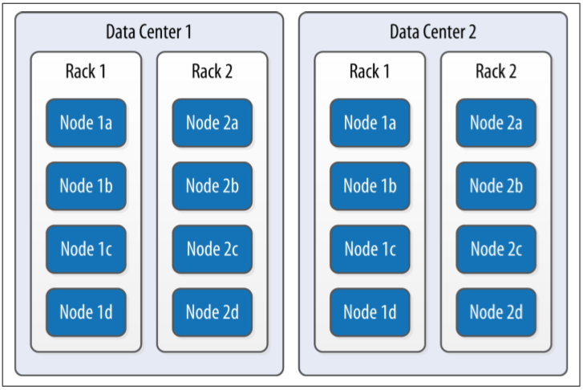

# Chapter 6. The Cassandra Architecture

## Data Centers and Racks

* 카산드라는 물리적으로 독립적인 공간에 시스템을 분산시킬수 있다.
* 카산드라는 2레벨로 그룹핑을 한다. \(Data Center, Rack\)
  * Rack : 물리적인 하나의 장비에 있고 서로 가까이에 존재하는 논리적 노드들의 집합
  * Data Center : Rack의 논리적 집합 \(아마도 같은 빌딩이고, 신뢰할수 있는 네트워크로 연결되어있는\)

