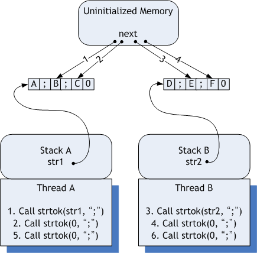

# Thread Safe VS Reentrant

* Thread-Safe : 여러 쓰레드에 의해 코드가 실행되더라도 실행 결과의 Correctness가 보장되는 것을 뜻한다.
* Reentrant  : 여러 쓰레드가 코드를 동시에 수행 할 수 있고, 그런 경우에도 실행결과의 Correctness가 보장됨을 뜻한다.

* Reentrant 한 코드는 Thread간에 공유하는 자원 자체가 없어야만 하는 코드이다. 쓰레드간에 동기화 메커니즘 자체가 필요 없게 만드는 코드이고,  Multi treading 환경에서 여러 쓰레드가 해당 코드를 동시에 실행 하더라도 아무런 문제가 없다. 
* Thread-safe 하다는 것은 단지 여러 쓰레드에 의해 실행되더라도 문제만 없으면 된다는 완화 조건이며 공유하는 자원이 있더라도 이것을 여러 쓰레드가 동시에 접근하지 못하도록 Locking-Mechanism 같은 것을 사용해 막아주면 된다.
* Thread-safe한 코드는 multi-threading 환경에서 reentrant 코드보다는 효율성이 떨어질 가능성이 높다.
* Thread-safe Code보다는 Reentrant Code로 작성하도록 노력하자.

