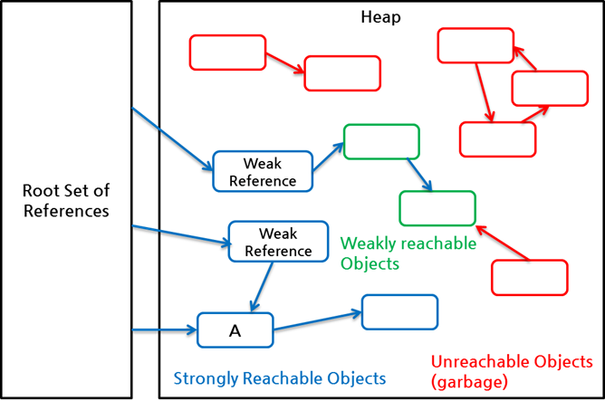
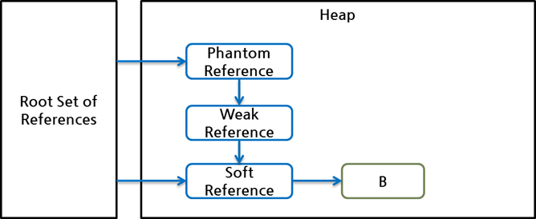

# Reference Object in Java

* Java 스펙에서는 SoftReference, WeakReference, PhantomReference 3가지 클래스에 의해 생성된 객체를 "reference object"라고 부른다. 이는 흔히 strong reference로 표현되는 일반적인 참조나 다른 클래스의 객체와는 달리 3가지 Reference 클래스의 객체에 대해서만 사용하는 용어이다. 또한 이들 reference object에 의해 참조된 객체는 "referent"라고 부른다. Java 스펙 문서를 참조할 때 이들 용어를 명확히 알면 좀 더 이해하기 쉽다. 위의 소스 코드에서 new WeakReference\(\) 생성자로 생성된 객체는 reference object이고, new Sample\(\) 생성자로 생성된 객체는 referent이다.

WEAK

SOFT

PHANTOM

### Strengths of Reachability 

앞에서 설명한 것처럼 reachability는 총 5종류가 있고 이는 GC가 객체를 처리하는 기준이 된다. Java 스펙에서는 이들 5종류의 reachability를 "Strengths of Reachability"라 부른다. 앞의 예제 그림에서는 weakly reachable만 예를 들었기 때문에 WeakReference만 표시하였으나, SoftReference, PhantomReference 등을 이용하여 여러 가지 방식으로 reachability를 지정할 수 있고 이에 따라 각 객체들의 GC 여부는 다양하게 달라지게 된다. 하나의 객체에 대한 참조의 개수나 참조 형태에는 아무런 제한이 없으므로, 하나의 객체는 여러 strong reference, soft reference, weak reference, phantom reference의 다양한 조합으로 참조될 수 있다.

Java GC는 root set으로부터 시작해서 객체에 대한 모든 경로를 탐색하고 그 경로에 있는 reference object들을 조사하여 그 객체에 대한 reachability를 결정한다. 다양한 참조 관계의 결과, 하나의 객체는 다음 5가지 reachability 중 하나가 될 수 있다.

* strongly reachable: root set으로부터 시작해서 어떤 reference object도 중간에 끼지 않은 상태로 참조 가능한 객체, 다시 말해, 객체까지 도달하는 여러 참조 사슬 중 reference object가 없는 사슬이 하나라도 있는 객체
* softly reachable: strongly reachable 객체가 아닌 객체 중에서 weak reference, phantom reference 없이 soft reference만 통과하는 참조 사슬이 하나라도 있는 객체
* weakly reachable: strongly reachable 객체도 softly reachable 객체도 아닌 객체 중에서, phantom reference 없이 weak reference만 통과하는 참조 사슬이 하나라도 있는 객체
* phantomly reachable: strongly reachable 객체, softly reachable 객체, weakly reachable 객체 모두 해당되지 않는 객체. 이 객체는 파이널라이즈\(finalize\)되었지만 아직 메모리가 회수되지 않은 상태이다.
* unreachable: root set으로부터 시작되는 참조 사슬로 참조되지 않는 객체

root set으로부터 바로 SoftReference를 통해서 B를 참조할 수 있기 때문이다. 만약 root set의 SoftReference에 대한 참조가 없다면\(즉, 왼쪽 아래 화살표를 삭제한다면\), 객체 B는 phantomly reachable이 된다.

[https://d2.naver.com/helloworld/329631](https://d2.naver.com/helloworld/329631)

