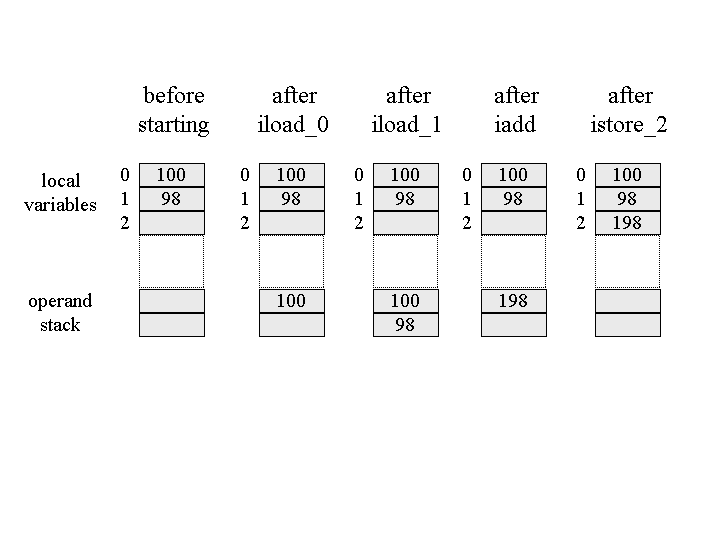

# Stack

### The Java Stack

새로운 쓰레드가 실행되면 JVM은 새로운 쓰레드를 위한 독립적인 stack을 생성해 Java Stack에 저장합니. JVM은 Stack에 Push,Pop Frame 2가지 Operation밖에 사용하지 않습니다.

thread에 의해 실행되는 method를 current method라고 하며 이때 저장한 stack frame을 current stack frame, 이때 current method에 의해 호출된 class를 current class, current class에 정의된 Constant pool을 current constant pool이라고 합니다.

스레드가 Java 메소드를 호출하면 가상 시스템은 스레드의 Java 스택에 새 프레임을 작성하고 푸시합니다. 그런 다음이 새 프레임이 현재 프레임이됩니다. 메소드가 실행되면 프레임을 사용하여 매개 변수, 로컬 변수, 중간 계산 및 기타 데이터를 저장합니다.

메소드는 두 가지 방법 중 하나로 완료 할 수 있습니다. 메서드가 반환하여 완료되면 정상 완료 라고합니다 . 예외를 throw하여 완료하면 갑작스럽게 완료 되었다고합니다 . 메소드가 정상적으로 종료했는지 갑자기 실패했을 경우, Java 가상 머신은 메소드의 스택 프레임을 팝 해 버립니다. 그러면 이전 메서드의 프레임이 현재 프레임이됩니다.  
  
스레드의 Java 스택에있는 모든 데이터는 해당 스레드에 대해 비공개입니다. 스레드가 다른 스레드의 Java 스택에 액세스하거나 변경할 수있는 방법은 없습니다. 따라서 Java 프로그램의 로컬 변수에 대한 다중 스레드 액세스를 동기화 할 필요가 없습니다. 스레드가 메소드를 호출하면 메소드의 로컬 변수는 호출하는 스레드의 Java 스택에있는 프레임에 저장됩니다. 단 하나의 스레드 만이 메소드를 호출 한 스레드 인 로컬 변수에 액세스 할 수 있습니다.

메소드 영역 및 힙과 마찬가지로 Java 스택 및 스택 프레임도 메모리에서 연속적 일 필요는 없습니다. 프레임은 인접한 스택에 할당되거나 힙이나 둘 중 일부 조합에 할당 될 수 있습니다. Java 스택 및 스택 프레임을 표현하는 데 사용되는 실제 데이터 구조는 구현 설계자의 결정입니다. 구현을 통해 사용자 또는 프로그래머는 최대 또는 최소 크기뿐만 아니라 Java 스택의 초기 크기를 지정할 수 있습니다.

### The Stack Frame

스택 프레임은 로컬 변수, 피연산자 스택 및 프레임 데이터의 세 부분으로 구성됩니다. 로컬 변수와 피연산자 스택의 크기는 단어 단위로 측정되며 각각의 개별 메소드의 필요성에 따라 달라집니다. 이러한 크기는 컴파일시 결정되며 각 메서드의 클래스 파일 데이터에 포함됩니다. 프레임 데이터의 크기는 구현에 따라 다릅니다.  
  
Java 가상 머신은 Java 메소드를 호출 할 때 클래스 데이터를 점검하여 로컬 변수와 피연산자 스택에서 메소드가 필요로하는 단어의 수를 판별합니다. 메서드에 적합한 크기의 스택 프레임을 생성하고 이를 Java 스택에 푸시합니다.

### Local Variables 

로컬 변수에서 long 또는 double을 참조하기 위해 명령어는 두 개의 연속 된 항목 중 첫 번째 항목이 차지하는 인덱스를 값으로 제공합니다. 예를 들어, long배열 항목 3과 4를 차지하는 경우 명령은 long인덱스 3을 참조합니다 . 로컬 변수의 모든 값은 워드로 정렬됩니다. 이중에서 항목 long 및 double는 모든 색인에서 시작할 수 있습니다.  
  
로컬 변수 섹션에는 메서드의 매개 변수와 로컬 변수가 들어 있습니다. 컴파일러는 매개 변수를 선언 된 순서대로 먼저 로컬 변수 배열에 배치합니다. 그림 stack-1은  다음 두 가지 방법에 대한 로컬 변수 섹션을 보여줍니다.

```java
class Example3a { 
    public static int runClassMethod(int i, long l, float f, double d, Object o, byte b) { 
        return 0; 
    } 
    public int runInstanceMethod(char c, double d, short s, boolean b) { 
        return 0; 
    } 
}
```


stack-1 에서 소스 변수에 해당 매개 변수가 없는 경우에도 runInstanceMethod\(\) 지역 변수의 첫 번째 매개 변수는 reference입니다. 이것은 모든 인스턴스 메소드로 전달 되는 숨겨진 참조\(this\)입니다. 인스턴스 메소드는 이 참조를 사용하여 호출 된 오브젝트의 인스턴스 데이터에 액세스합니다. 그림 5-9 runClassMethod\(\)의 지역 변수를 보면 알 수 있듯이 클래스 메소드는 숨겨진 값\(this\)을 받지 못합니다. 클래스 메소드는 객체에서 호출되지 않습니다. 메소드 호출과 연관된 인스턴스가 없기 때문에 클래스 메소드에서 클래스의 인스턴스 변수에 직접 액세스 할 수 없습니다.

소스 코드에서 타입 byte,short,char 는 지역 변수에서 int가 됩니다. 이것은 피연산자 스택에도 적용됩니다. 앞서 언급했듯이 boolean 유형은 Java 가상 머신에 의해 직접 지원되지 않습니다. 자바 컴파일러는 항상 int 를 사용 하여 로컬 변수 또는 피연산자 스택의 값 을 나타냅니다 . 그러나 byte, short, char들은 Java 가상 시스템에서 직접 지원됩니다. 이들은 힙에 인스턴스 변수 또는 배열 요소로 저장되거나 메소드 영역에는 클래스 변수로 저장 될 수 있습니다. 로컬 변수 또는 오퍼랜드 스택에 배치 된 경우에 byte, short, char들은 int로 변환되어 저장됩니다. byte, short, char 들은 Stack frame안에서는 int로 관리되며 heap or method area에 다시 저장될때는 byte, short, char로 변환됩니다.

또한 runClassMethod\(\)를 보면 Object o가 reference로 전달됩니다 자바에서는 모든 객체가 reference로 전달됩니다. 모든 객체가 힙에 저장되므로 로컬 변수 나 피연산자 스택에서 객체의 이미지를 찾을 수 없고 reference만 찾을 수 있습니다.

### Operand Stack

로컬 변수와 마찬가지로 피연산자 스택은 단어 배열로 구성됩니다. 그러나 배열 인덱스를 통해 액세스되는 로컬 변수와 달리 값을 푸시하고 팝핑하여 피연산자 스택에 액세스합니다. instruction이 피연산자 스택에 값을 푸시하면 나중에 instruction이 해당 값을 팝하여 사용할 수 있습니다.

가상 머신은 오퍼랜드 스택에 지역변수들을 동일한 데이터 유형\(int, long, float, double, reference, 및 returnType\)으로 저장합니다. 오퍼랜드 스택으로 byte,short,char,int 들을 push하기 전에 값을 변경합니다.

명령어로 직접 액세스 할 수없는 프로그램 카운터 이외에 Java 가상 머신에는 레지스터가 없습니다. Java 가상 머신은 명령어가 레지스터가 아닌 피연산자 스택에서 피연산자를 가져 오기 때문에 레지스터 기반이 아니라 스택 기반입니다. 명령어는 바이트 코드 스트림의 opcode \(명령어를 나타내는 바이트\) 또는 상수 풀에서 즉시 따라 오는 등의 다른 장소에서 피연산자를 가져올 수도 있습니다. 그러나 Java 가상 머신 명령어 세트의 주요 초점은 피연산자 스택입니다.  
  
Java 가상 머신은 피연산자 스택을 작업 공간으로 사용합니다. 많은 명령어가 피연산자 스택에서 값을 팝핑하고 연산 한 다음 결과를 푸시합니다. 예를 들어, iadd명령어는 두 개의 정수를 추가하여 두 개의 정수를 int피연산자 스택의 맨 위에서 두 개 팝핑 하고 추가 한 다음 int결과를 푸시합니다 . 다음은 Java 가상 머신이 ints 를 포함하는 두 개의 로컬 변수를 추가 하고 int그 결과를 세 번째 로컬 변수에 저장하는 방법입니다 .

```text
iload_0 // 로컬 변수 0에 int를 푸시합니다.
iload_1 // 로컬 변수 1에 int를 푸시합니다.
iadd // pop int 두 개를 추가하고 결과를 밀어 넣습니다.
istore_2 // pop int, 로컬 변수 2에 저장
```

바이트 코드의 처음 두 명령어의 시퀀스 iload\_0와 iload\_1는 오퍼랜드 스택의 int로컬 변수의 0,1 위치에 저장하는 명령어 입니다.

iadd 명령은 저장된 2개의 값을 꺼내서 두개를 더하고 그 int값을 오퍼랜드 스택의 int 위치에 저장합니다. 네 번째 명령어 인 istore\_2 결과를 오퍼랜드 스택 맨 위에서 꺼내고 로컬 변수 위치 2에 저장합니다.  그림 5-10에서는 이러한 명령어를 실행하는 동안 로컬 변수와 피 연산자 스택의 상태를 그래픽으로 보여 줍니다. 이 그림에서 지역 변수 및 피 연산자 스택의 사용되지 않은 슬롯은 비어 있습니다.




