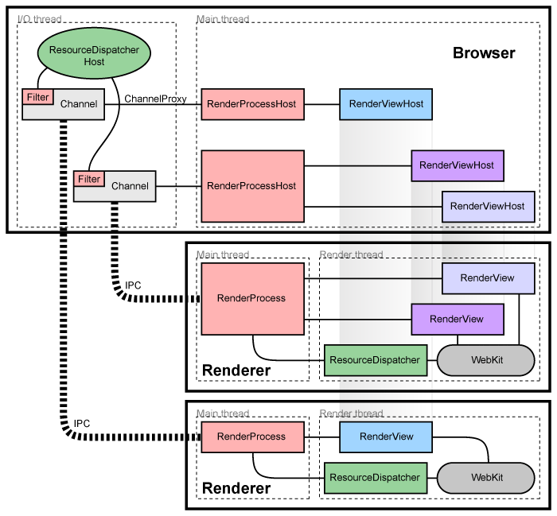

# Chromium

* Multi-process Architecture
  * [https://www.chromium.org/developers/design-documents/multi-process-architecture](https://www.chromium.org/developers/design-documents/multi-process-architecture)
* Inside look at modern web browser

  * [https://d2.naver.com/helloworld/2922312](https://d2.naver.com/helloworld/2922312)
  * [https://d2.naver.com/helloworld/9274593](https://d2.naver.com/helloworld/9274593)
  * [https://d2.naver.com/helloworld/5237120](https://d2.naver.com/helloworld/5237120)
  * [https://d2.naver.com/helloworld/6204533](https://d2.naver.com/helloworld/6204533)

* How Chromium Displays Web Pages 
  * [https://www.chromium.org/developers/design-documents/displaying-a-web-page-in-chrome](https://www.chromium.org/developers/design-documents/displaying-a-web-page-in-chrome)

